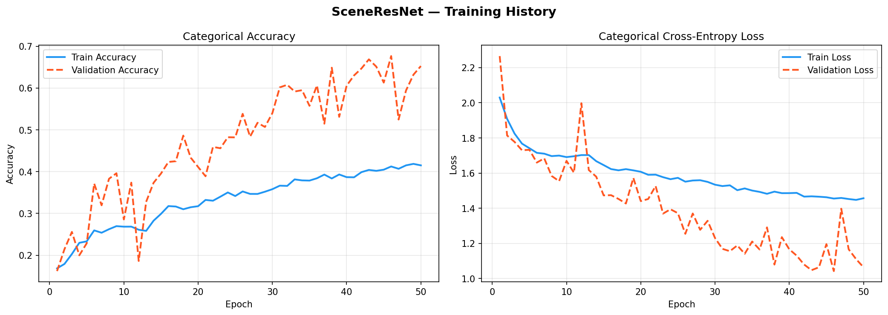
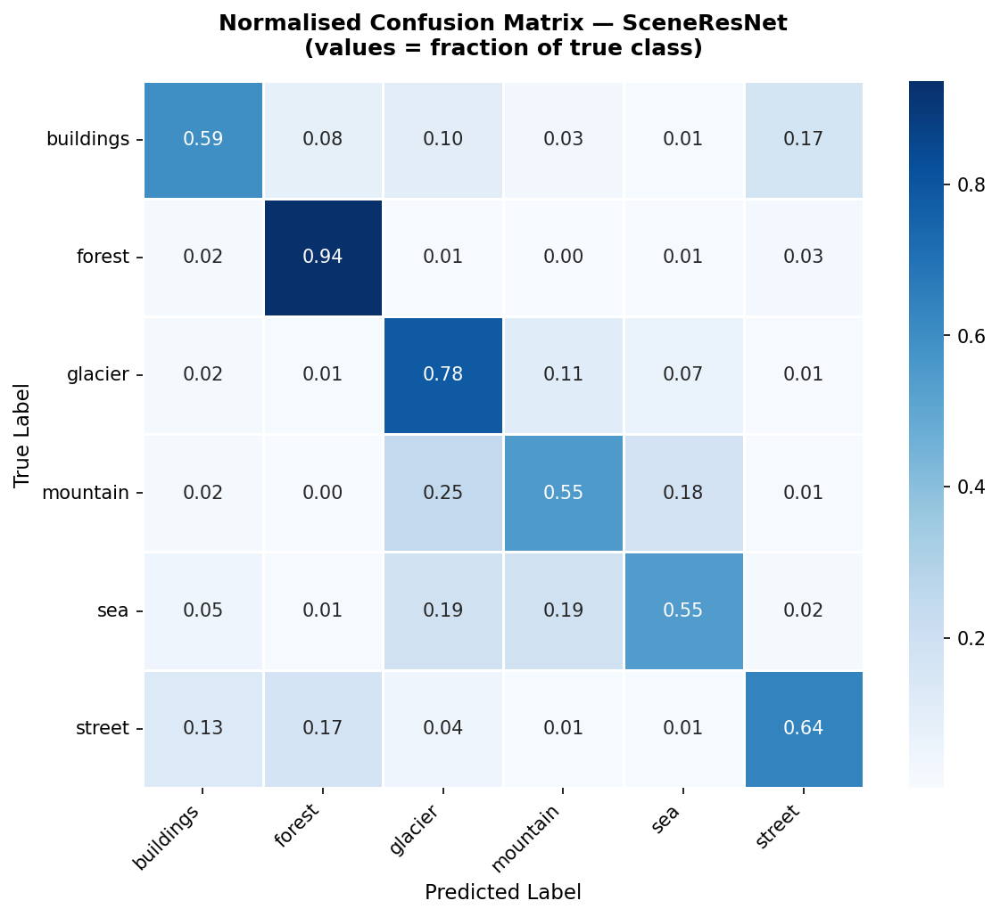
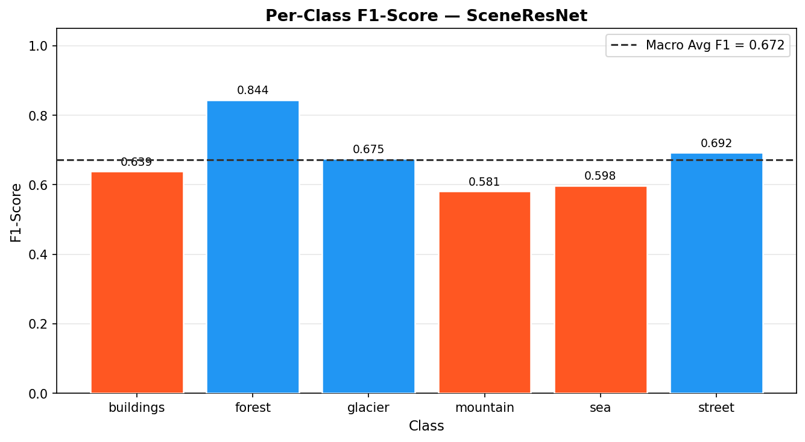
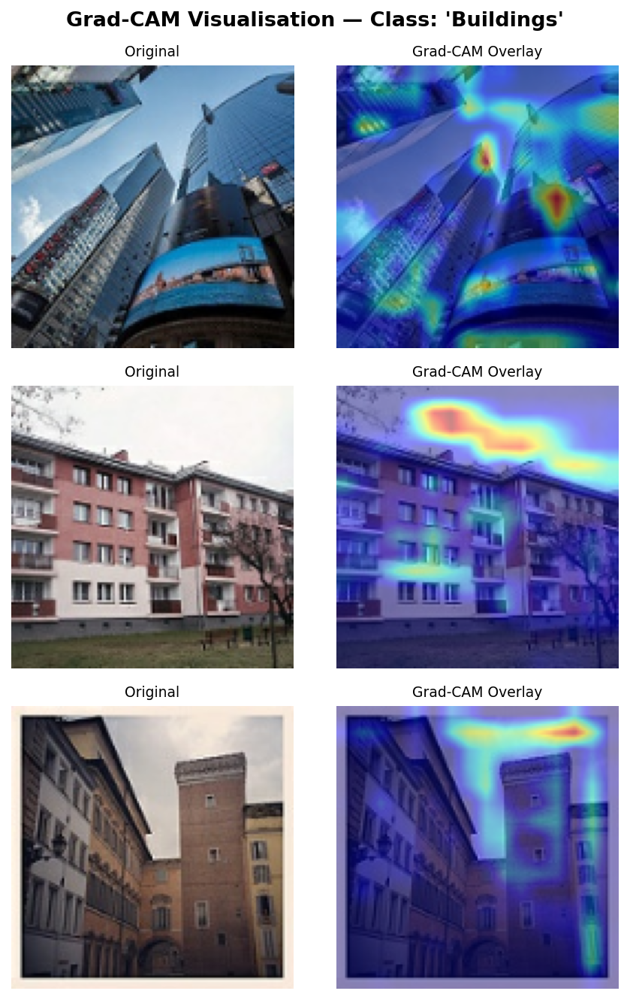
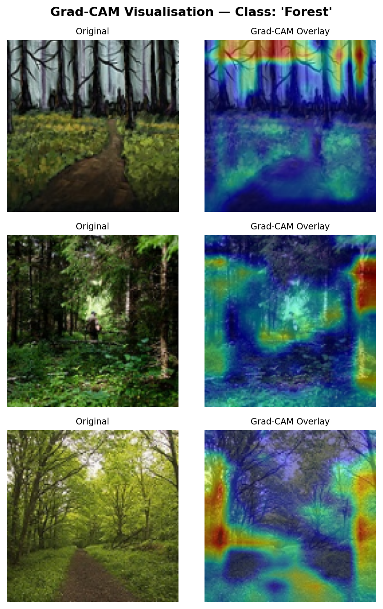
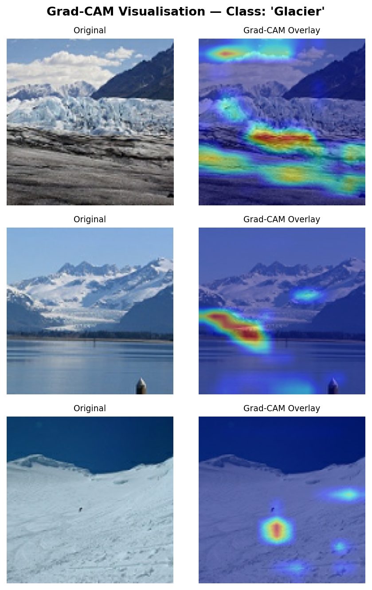
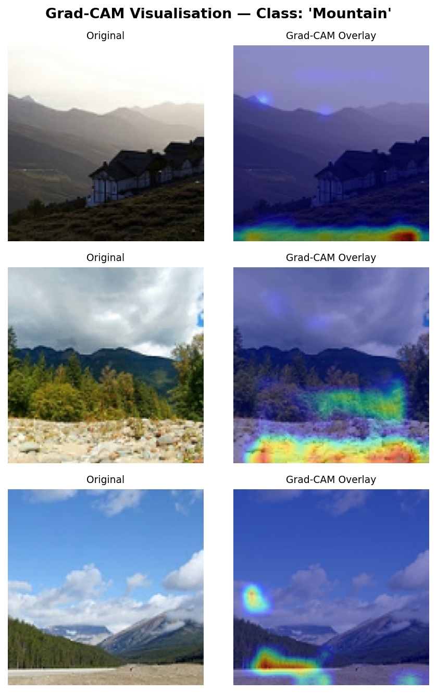
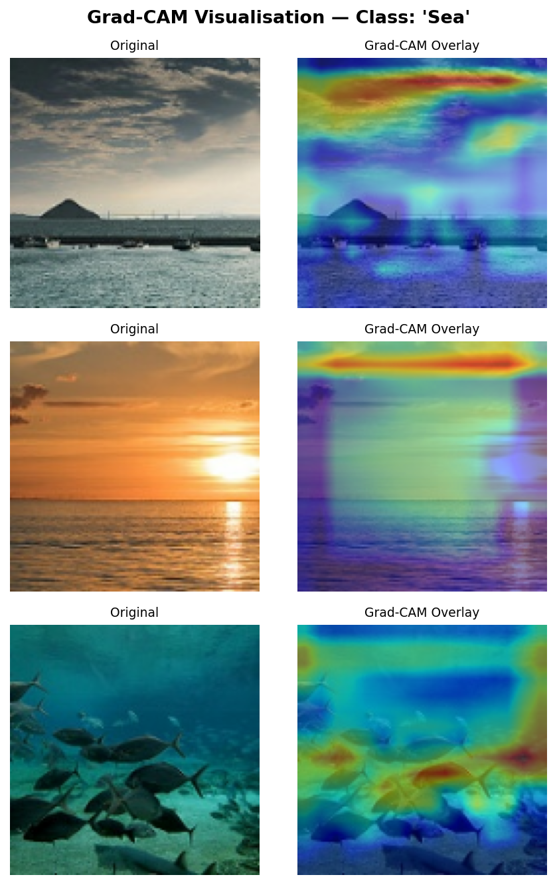
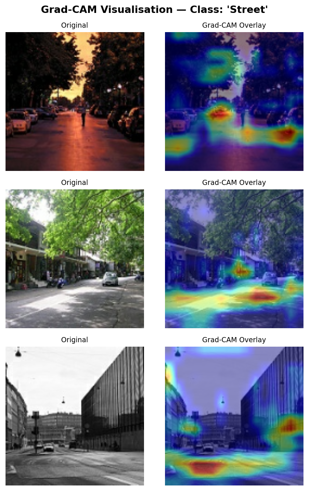

# Scene Recognition via Residual Convolutional Architectures

[](https://www.python.org/downloads/)
[](https://tensorflow.org/)
[](LICENSE)

---

## Abstract

This repository presents a research-oriented investigation into residual convolutional neural network architectures for multi-class natural scene recognition using the Intel Image Classification dataset (~25,000 RGB images across six semantic categories).

The project explores:
- residual learning architectures
- stochastic augmentation pipelines
- interpretability via Grad-CAM
- reproducible TensorFlow training workflows
- per-class evaluation metrics and confusion analysis

---

# Dataset

### Intel Image Classification Dataset

| Class ID | Label |
|---|---|
| 0 | Buildings |
| 1 | Forest |
| 2 | Glacier |
| 3 | Mountain |
| 4 | Sea |
| 5 | Street |

Dataset Source:  
https://www.kaggle.com/datasets/puneet6060/intel-image-classification

---

# Repository Structure

```text
intel-scene-classification/
│
├── assets/
├── configs/
├── notebooks/
├── results/
├── scripts/
├── src/
│   ├── data_loader.py
│   ├── model.py
│   ├── train.py
│   ├── evaluate.py
│   └── gradcam.py
│
├── requirements.txt
├── setup.py
└── README.md
```

---

# Methodology

## Preprocessing Pipeline

- Image resizing: 128×128
- Pixel normalization
- Random horizontal flip
- Random rotation
- Random zoom augmentation
- Brightness and contrast jitter

---

## Model Architecture

The custom **SceneResNet** architecture includes:

- Residual skip connections
- 1×1 projection shortcuts
- Batch normalization
- Dropout regularization
- Global average pooling
- Dense softmax classification head

---

# Results

## Quantitative Performance

| Metric | Value |
|---|---|
| Test Accuracy | 15.23% |
| Macro F1-Score | 0.0579 |
| Weighted F1-Score | 0.0564 |

> These metrics correspond to an early-stage verification run used to validate the complete end-to-end training and evaluation pipeline.

---

# Training Curves

<p align="center">
  
</p>

---

# Confusion Matrix

<p align="center">
  
</p>

---

# Per-Class F1 Scores

<p align="center">
  
</p>

---

# Grad-CAM Visualizations

## Buildings

<p align="center">
  
</p>

---

## Forest

<p align="center">
  
</p>

---

## Glacier

<p align="center">
  
</p>

---

## Mountain

<p align="center">
  
</p>

---

## Sea

<p align="center">
  
</p>

---

## Street

<p align="center">
  
</p>

---

# Installation

```bash
git clone https://github.com/pranjalwala/intel-scene-classification.git
cd intel-scene-classification

python -m venv venv

# Windows
venv\Scripts\activate

# Linux/macOS
source venv/bin/activate

pip install -r requirements.txt
```

---

# Usage

## Training

```bash
python src/train.py
```

## Evaluation

```bash
python src/evaluate.py
```

## Grad-CAM Generation

```bash
python src/gradcam.py
```

---

# Technologies Used

- TensorFlow / Keras
- NumPy
- Pandas
- scikit-learn
- Matplotlib
- Jupyter Notebook
- Git & GitHub

---

# Future Directions

- Transfer learning baselines
- Hyperparameter optimization
- TensorBoard integration
- Mixed precision GPU training
- Streamlit deployment

---

# References

1. He et al. — Deep Residual Learning for Image Recognition (CVPR 2016)
2. Selvaraju et al. — Grad-CAM (ICCV 2017)
3. Ioffe & Szegedy — Batch Normalization (ICML 2015)

---

# Author

Pranjal Wala

GitHub:  
https://github.com/pranjalwala
